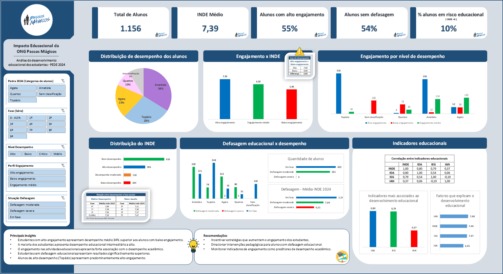

# Datathon - Análise de Impacto Educacional | ONG Passos Mágicos
## Dashboard Analítico
Projeto de análise de impacto educacional utilizando dados da Pesquisa Extensiva de Desenvolvimento Educacional (PEDE 2024).



Este projeto foi desenvolvido como parte de um Datathon de Data Analytics com o objetivo de analisar o desenvolvimento educacional de estudantes atendidos pela ONG Passos Mágicos.

A análise utiliza dados da **Pesquisa Extensiva de Desenvolvimento Educacional (PEDE 2024)** para identificar fatores associados ao desempenho acadêmico dos alunos.
A análise foi conduzida utilizando técnicas de análise exploratória de dados (EDA) e estatísticas descritivas.

---

# Objetivo do projeto

O objetivo desta análise é:

- Avaliar o nível de desenvolvimento educacional dos estudantes
- Identificar fatores associados ao desempenho acadêmico
- Analisar o impacto do engajamento e da defasagem educacional nos resultados dos alunos

---

# Base de dados

A análise foi realizada com base nos dados da **Pesquisa Extensiva de Desenvolvimento Educacional (PEDE 2024)**.

A base contém informações educacionais de **1.156 estudantes**, incluindo indicadores de:

- Desempenho acadêmico
- Engajamento nas atividades educacionais
- Adequação entre idade e nível educacional
- Índice de Desenvolvimento Educacional (INDE)

---

# Indicadores analisados

Os principais indicadores utilizados foram:

- **INDE** – Índice de Desenvolvimento Educacional
- **IDA** – Indicador de Desempenho Acadêmico
- **IEG** – Indicador de Engajamento
- **IAN** – Indicador de Adequação de Nível

---

# Principais análises realizadas

- Distribuição do desempenho educacional dos estudantes
- Engajamento educacional x desempenho acadêmico
- Defasagem educacional x desempenho
- Perfil de engajamento por nível de desempenho
- Distribuição do INDE
- Correlação entre indicadores educacionais

---

# Principais insights

- A maioria dos estudantes apresenta desempenho educacional intermediário a alto, sendo que aproximadamente 81% dos alunos estão classificados nas categorias de bom ou alto desempenho.
-	O engajamento nas atividades educacionais apresenta forte associação com o desempenho acadêmico, com estudantes de alto engajamento apresentando média de INDE de 7,93, enquanto alunos de baixo engajamento apresentam média de 5,90, representando uma diferença de 2,03 pontos no índice.
-	Estudantes sem defasagem educacional apresentam resultados significativamente superiores, com média de INDE de 7,77, em comparação com 6,51 entre alunos com defasagem severa.
-	Alunos de alto desempenho apresentam predominantemente altos níveis de engajamento educacional, indicando forte relação entre participação nas atividades educacionais e resultados acadêmicos.


---

# Estrutura do projeto

```
datathon-passos-magicos
│
├── dashboard
│   └── datathon_dashboard_passos magicos.xlsx
│
├── relatorio
│   └── relatorio_analitico.pdf
│
├── apresentacao
│   └── apresentacao_executiva.pdf
│
└── README.md
```

---

# Ferramentas utilizadas

- Microsoft Excel
- Análise exploratória de dados
- Visualização de dados
- Dashboard analítico
- PowerPoint
- Microsoft Word

---

# Conclusão

Os resultados indicam que o engajamento educacional desempenha papel fundamental no desenvolvimento acadêmico dos estudantes atendidos pela ONG Passos Mágicos, reforçando a importância de iniciativas educacionais voltadas à participação ativa dos alunos no processo de aprendizagem.
